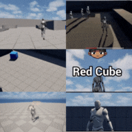

# 🧩 Unreal Engine Blueprint Showcase

A curated collection of **Unreal Engine 5.5.4** mini-projects — each one a focused, standalone system built to demonstrate clean, production-level Blueprint design.
Every project targets a core gameplay or visual mechanic that can scale into full systems for professional Unreal development.

---

## 🎞️ Project Gallery

Explore the projects below 👇
Each entry includes a **Blueprint workflow**, **GIF preview**, and **feature breakdown** — perfect for learning, prototyping, or integrating directly into your own UE projects.

---

# 💀 Project 1 – Triggered Jump Scare System 
**[Medium Guide](https://medium.com/@fulton_shaun/how-to-create-a-triggered-jump-scare-in-unreal-engine-5-cac5687edf52)** • **[YouTube Tutorial](https://www.youtube.com/watch?v=9ttzdLqb0oM)**

This project demonstrates how to build a **cinematic triggered jump scare** in **Unreal Engine 5.5.4** using Blueprints only.
It combines sound, animation, and visibility logic into one clean event that activates the moment a player enters a trigger zone — delivering a sharp, timed horror effect without any C++.

---

## 🖼️ Preview

---

## 🧱 Features

- **Hidden Skeletal Mesh (JumpScare)** attached to the player camera
- **Trigger Box** activates event on player overlap
- **Cast To BP_ThirdPersonCharacter** ensures player-only trigger
- **Do Once** node prevents reactivation
- **Play Sound 2D** for synchronized scream or impact sound
- **Set Visibility + Play Animation** combo for visual scare moment
- **Delay node** hides the mesh again for reset
- Entire system built with clean, minimal Blueprint logic — zero scripting required

---

## 🚀 Result

As soon as the player enters the trigger zone, the **jump scare mesh appears**, **animation plays**, and **sound hits** — all in sync.
After a short delay, the mesh vanishes, leaving behind a perfectly timed, cinematic horror moment.

---

# ⚔️ Project 2 – Enemy AI Follow, Wait, and Strike System 
**[Medium Guide](https://medium.com/@fulton_shaun/create-an-enemy-ai-that-follows-waits-and-strikes-using-behavior-trees-365bda702c96?postPublishedType=initial)** • **[YouTube Tutorial](https://www.youtube.com/watch?v=ZICaWSZ21VY&t=144s)**

This project builds a **distance-aware enemy AI** in **Unreal Engine 5.5.4** using Behavior Trees and Blueprint-driven logic.
The enemy tracks the player, pauses when out of range, and launches real melee attacks only when close enough to hit — all without relying on complex perception systems.

---

## 🖼️ Preview

---

## 🧱 Features

- **BP_Enemy** built from the Third Person Character template
- **AIC_Enemy** using `DetourCrowdAIController` for smoother navigation
- **BT_Enemy + BB_Enemy** controlling follow, wait, and attack flow
- **Detector Sphere** triggers player acquisition
- **Hand Collision Sphere** deals melee damage during attacks
- **Root-motion attack montages** selected and played randomly
- **BTT_Attack task** fires clean Blueprint-driven attack logic
- **Player health system** with damage, death checks, and regen-safe updates
- **WBP_HealthBar** anchored to screen with live health percentage
- **Ragdoll death flow**, input lock, UI swap, and automatic level restart
- Clean, modular Blueprint setup ideal for expansion (perception, combos, stats, etc.)

---

## 🚀 Result

Enemies **detect**, **follow**, **pause**, and **attack** the player with responsive, readable behavior.
The system includes **health UI**, **damage logic**, and a complete **death/restart loop**, creating a fully functional combat-ready AI suitable for prototypes or full gameplay systems.

---

# 🌌 Project 3 – Teleporting Wander AI System
**[Medium Guide](https://medium.com/@fulton_shaun/how-to-create-a-teleporting-npc-in-unreal-engine-5-enderman-style-movement-ff216f36d140)** • **[YouTube Tutorial](https://www.youtube.com/watch?v=S_5Gg4rSV2o&t=1s)**

This project creates a **wandering NPC that randomly teleports** across the level using **Unreal Engine 5.5.4**, Blueprint logic, Behavior Trees, and Niagara VFX. The NPC walks naturally like a standard roaming AI but occasionally **vanishes and reappears** at new NavMesh points using custom teleport logic and stylized visual effects.

---

## 🖼️ Preview

---

## 🧱 Features

- **BP_NPC** upgraded with unlit black body material and emissive eye material
- **M_Skin** for silhouette-style shading
- **M_Eyes** for bright purple emissive glow
- **NS_Aura** ambient Niagara system that follows the NPC
- **NS_TeleportEffect** burst VFX used for vanish and reappear moments
- **Scaled mesh** for tall, Enderman-inspired proportions
- **BP_Spawner** that spawns the NPC with initial teleport VFX
- **BTT_Teleport** task handling teleport chance, vanish effect, location update, and reappear effect
- Works seamlessly with the existing **wander behavior** from BT_NPC

---

## 🚀 Result

The NPC **wanders**, **pauses**, and **teleports** across the level with smooth transitions. Disappear and reappear effects sell the movement style, creating an unpredictable and visually striking roaming character suitable for horror, fantasy, or experimental gameplay.

---

# 🎮 Project 4 – Floating Interaction Prompt System
**[Medium Guide](https://medium.com/@fulton_shaun/unreal-engine-5-floating-interaction-prompt-system-528e892a3f7e)** • **[YouTube Tutorial](https://www.youtube.com/watch?v=E9fZErlzS8Q)**

This project adds a **camera-facing floating interaction prompt** to any object in **Unreal Engine 5.5.4** using simple Blueprint logic.
The prompt appears when the player enters a detection radius, stays perfectly readable from all angles, and cleanly disappears when the player leaves — ideal for pickups, doors, NPCs, and world objects.

---

## 🖼️ Preview

---

## 🧱 Features

- Convert any placed prop into a Blueprint actor
- **Sphere Collision** used as a proximity trigger
- **Widget Component** displaying `WBP_Prompt`
- Text-based prompt with optional outline and icon
- Widget set to **Screen Space** for automatic camera-facing behavior
- **Overlap logic** shows and hides the prompt when player enters/exits
- Clean, reusable Blueprint setup for all interactable objects

---

## 🚀 Result

As the player approaches an interactive object, the floating prompt **appears**, stays **perfectly oriented toward the camera**, and then **vanishes** once the player steps away.
This creates a polished, universal interaction indicator that can be added to any object across your project.

---

# 🔥 Project 5 – Fire Hazard Damage, Burning, and Death System
**[Medium Guide](https://medium.com/@fulton_shaun/how-to-fire-apply-damage-to-the-character-in-unreal-engine-5-edac17bacd47)** • **[YouTube Tutorial](https://www.youtube.com/watch?v=gemx1y3ZRQE)**

This project builds a **fully-featured fire hazard system** in **Unreal Engine 5.5.4**, complete with ignition zones, damage-over-time, lingering burn effects, on-player fire VFX, and a clean ragdoll death sequence.
The player ignites the instant they touch the flames, continues taking damage even after stepping out, and collapses into a fully simulated ragdoll when health reaches zero.

---

## 🖼️ Preview

---

## 🧱 Features

- **Blueprint fire actor** converted from `P_Fire` particle system
- **Sphere Collision** ignition zone for detecting player overlap
- **FireFX particle system** attached to the character’s `spine_01` socket
- **Burning state logic** using `isBurning`, `BurnDuration`, and `PlayerHealth` variables
- **Burst damage timer** that applies fire damage while inside the hazard
- **Lingering burn timer** that continues applying reduced damage after exit
- **Automatic FireFX activation/deactivation** based on burn state
- **Clean death function** using ragdoll simulation and input disable
- Modular Blueprint setup ideal for reuse across hazards and environments

---

## 🚀 Result

As soon as the player steps into the flames, they ignite instantly, take regular burst damage, and remain aflame even after escaping the hazard.
Once health reaches zero, the character collapses into a physics-driven ragdoll, completing a polished and fully reactive fire danger system.

---

# 🎥 Project 6 – Triggered Cutscene Camera Sequence System
**[Medium Guide](https://medium.com/@fulton_shaun/ue5-simple-triggered-cutscene-tutorial-72285f69e6ac)** • **[YouTube Tutorial](https://www.youtube.com/watch?v=-EL6dAxIh58)**

This project creates a **cinematic triggered cutscene** in **Unreal Engine 5.5.4** using a Level Sequence, CineCamera, and Blueprint logic.
When the player enters a trigger zone, gameplay input locks, the camera switches to a Sequencer-driven shot, and control returns automatically once the cutscene finishes.

---

## 🖼️ Preview

---

## 🧱 Features

- **BP_Boss** placeholder character derived from `BP_ThirdPersonCharacter`
- **CineCameraActor** positioned and animated inside a Level Sequence
- **Three-keyframe cinematic camera move** showcasing the boss
- **Trigger Volume** activating the cutscene via player overlap
- **Cast To BP_ThirdPersonCharacter** to ensure player-only activation
- **Do Once** node to prevent replay loops
- **Disable Input → Play Sequence → Enable Input** flow
- **Get Duration** node for timing sync with sequence length
- Clean, minimal Level Blueprint setup

---

## 🚀 Result

When the player walks into the trigger zone:

- Player input locks
- CineCamera takes over
- The shot sequence plays start to finish
- Control is restored the moment the cutscene ends

This creates a polished gameplay introduction ideal for boss reveals, environment showcases, puzzle hints, or any in-game cinematic moment.
